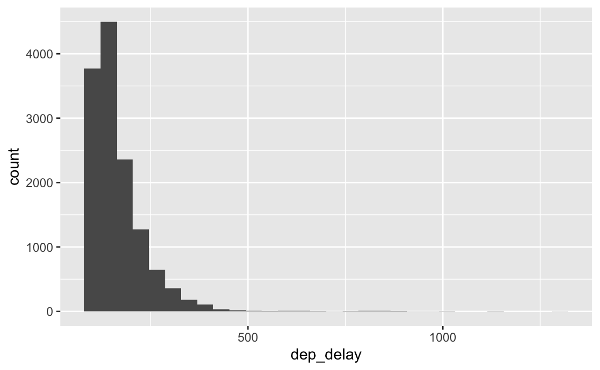
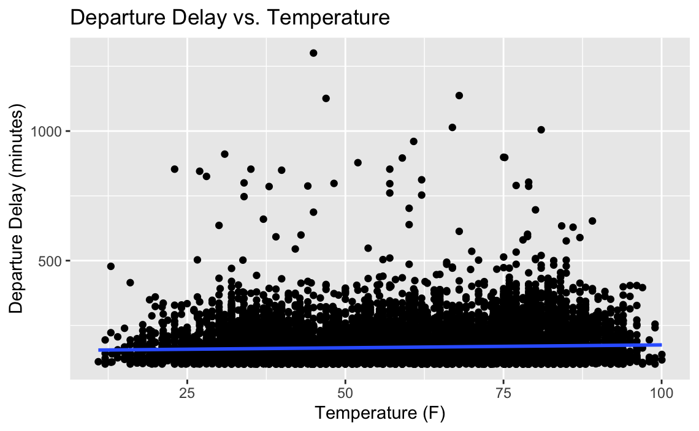
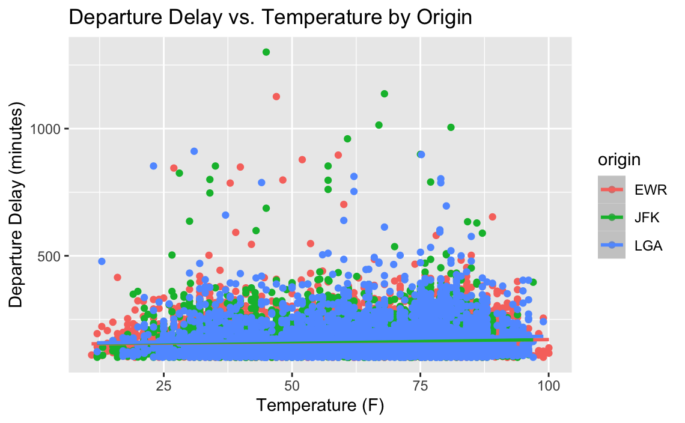
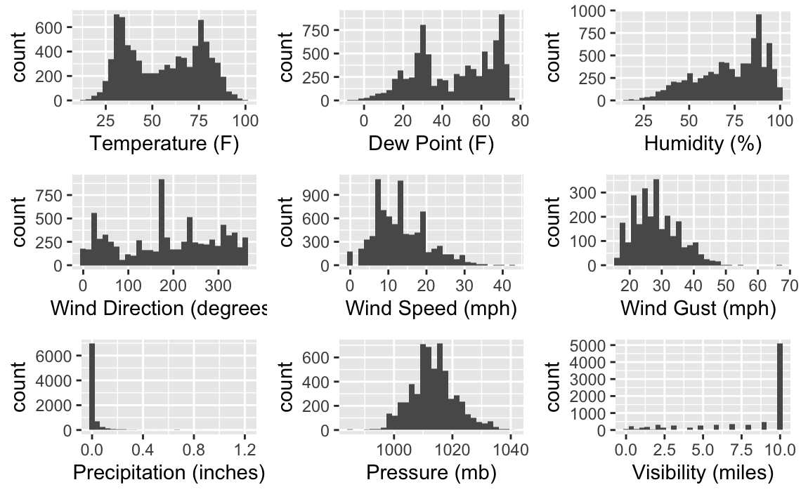
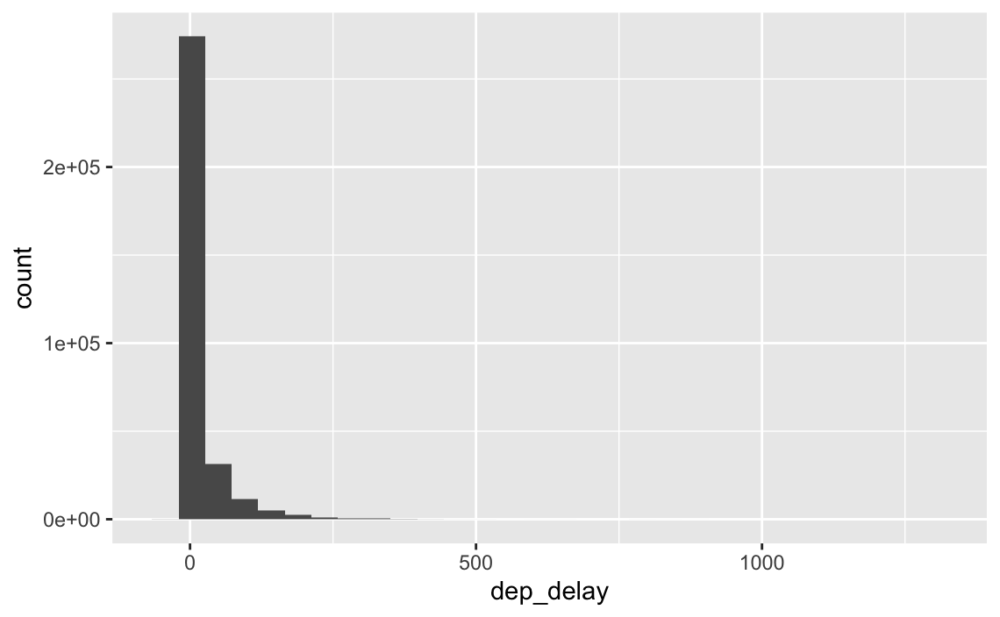

# NYC Flights Weather & Delay Analysis

Exploratory data analysis project using the `nycflights13` dataset to analyze flight departure delays, weather conditions, and airport operational patterns across New York City airports.

This project focuses on identifying relationships between flight delays and weather-related variables through statistical visualization and exploratory analysis in R.

---

# Project Overview

This repository contains exploratory visualizations and analyses examining:
- departure delays
- weather conditions
- airport operational patterns
- temperature relationships
- visibility conditions
- wind behavior
- precipitation trends

The analysis was designed to explore how environmental and operational variables may influence departure delays across NYC airports.

---

# Tools & Technologies

- R
- ggplot2
- dplyr
- tidyr
- nycflights13
- Exploratory Data Analysis
- Statistical Visualization

---

# Analytical Focus Areas

- Flight delay analysis
- Weather impact analysis
- Distribution analysis
- Exploratory visualization
- Airport operational analysis
- Comparative analysis
- Statistical plotting
- Data storytelling

---

# Key Analyses

## Departure Delay Distribution

Histogram analysis showing the distribution of departure delays across flights departing from NYC airports.

The visualization highlights:
- heavily right-skewed delay behavior
- concentration of shorter delays
- presence of extreme outliers



---

## Departure Delay vs Temperature

Scatterplot analysis examining the relationship between departure delays and temperature conditions.

The analysis explores:
- operational behavior across temperature ranges
- clustering patterns
- delay outliers
- potential weather-related trends



---

## Delay Analysis by Airport Origin

Comparative visualization examining delay patterns across:
- EWR
- JFK
- LGA

The analysis helps identify airport-level operational variation and delay concentration patterns.



---

## Weather Variable Distribution Grid

Multi-panel histogram visualization analyzing weather variables including:
- temperature
- humidity
- wind speed
- precipitation
- pressure
- visibility
- wind gusts

This visualization supports broader exploratory weather analysis and environmental trend identification.



---

## Binned Delay Distribution

Additional histogram analysis using alternative bin sizing to better visualize departure delay concentration and long-tail behavior.



---

# Key Insights

- Departure delays show a strongly right-skewed distribution with significant outliers.
- Most flights experience relatively small delays while a smaller number experience extreme operational disruptions.
- Temperature alone does not appear to strongly predict departure delays.
- Weather variables such as visibility, precipitation, and wind conditions demonstrate meaningful operational variability.
- Airport-level comparisons reveal variation in delay concentration across NYC airports.

---

# Repository Structure

```text
NYC-Flights-Analysis/
│
├── Data/
│   ├── README.md
│
├── Images/
│   ├── Bins.png
│   ├── Color.png
│   ├── Delay-vs-Temp.png
│   ├── Delays.png
│   └── Grid.png
│
├── Notebooks/
│
├── Reports/
│
└── README.md
```

---

# Files

| File | Description |
|------|-------------|
| `Images/Delays.png` | Departure delay distribution histogram |
| `Images/Delay-vs-Temp.png` | Delay vs temperature scatterplot |
| `Images/Color.png` | Delay comparison by airport origin |
| `Images/Grid.png` | Weather variable distribution grid |
| `Images/Bins.png` | Binned delay distribution visualization |

---

# Data

This project uses the `nycflights13` dataset available through the R package ecosystem.

The dataset contains commercial flight information for flights departing New York City airports and includes variables related to:
- airlines
- departure delays
- arrival delays
- destinations
- weather conditions
- aircraft information

The data was used for exploratory data analysis, statistical analysis, and visualization exercises.

---

# Skills Demonstrated

- Exploratory data analysis
- Statistical visualization
- R programming
- ggplot2 visualization
- Distribution analysis
- Comparative analysis
- Weather analysis
- Operational analytics
- Data storytelling

---

# Portfolio

Portfolio Website: https://cameronbatts.github.io/Portfolio.html

GitHub Profile: https://github.com/Cameron-Batts
